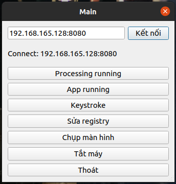
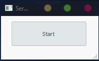
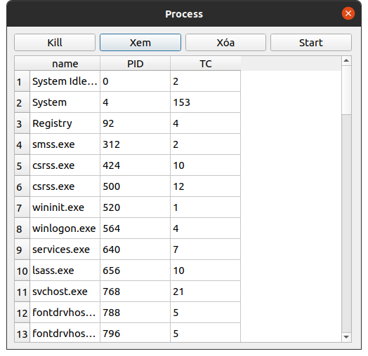
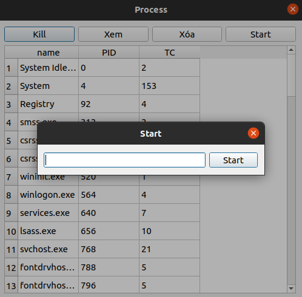
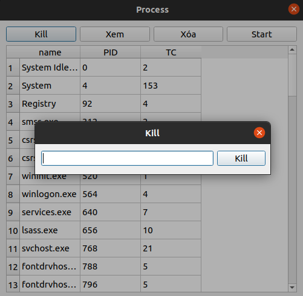
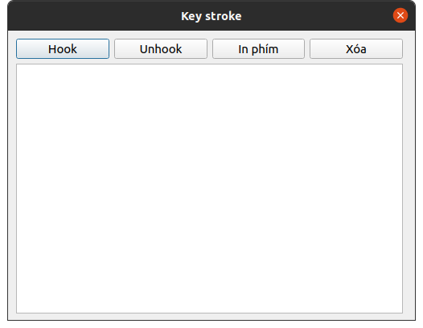
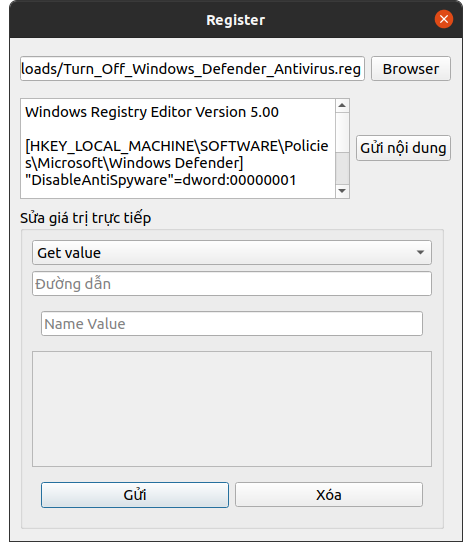
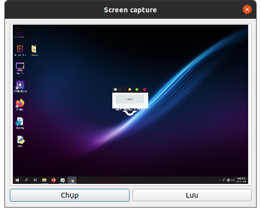


# REMOTE CONTROL OVER A COMPUTER WITH SOCKET
>## Điều khiển máy tính từ xa sử dụng Socket.
>[https://drive.google.com/file/d/1ikj0vE75GKcijg9dWYwSzcdCldW3DBfS/view?usp=sharing](https://drive.google.com/file/d/1ikj0vE75GKcijg9dWYwSzcdCldW3DBfS/view?usp=sharing)

 ## Contributor
 - Bùi Đình Nguyên Khoa
 - Cao Quốc Thắng
 
## Features
 - Xem, start, kill các process đang chạy
 - Xem, start, kill các app đang chạy
 - Keystroke
 - Sửa registry
 - Chụp màn hình
 - Tắt máy
 ## Prerequisites
 - Cài đặt Python3, pip
 - Cài đặt các thư viện PyQT, PynNut, WinReg... có trong `Requirement.txt`
 - Máy bị điều khiển chỉ hỗ trợ hệ điều hành Windows. Máy điều khiển và máy bị điều khiển trong cùng một mạng LAN
- Gọi máy bị điều khiển là Server. Máy điều khiển là Client.
## Installation
Clone repo

    git clone https://github.com/nguyenkhoa0721/Remote-Control-w-Socket
Cài đặt các requirements

    pip install -r requirements.txt
Đặt folder Server trên máy bị điều khiển. Chạy file `main.py`

    cd Server
    python3 main.py

Đặt folder Client trên máy điều khiển. Chạy file `main.py`

    cd Client
    python3 main.py
## Usage

 1. Kết nối
Khởi chạy Server. Port mặc định Server mở là `8080`

Kết nối Client đến Server. Nhập `IP máy:Port` và nhấn kết nối. Nếu kết nối thành công sẽ có cửa sổ thông báo kết nối thành công và trạng thái "no connection" sẽ chuyển thành IP của máy kết nối tới

2. Xử lý Process running và App running
 - Nhấn `Xem` để xem các process/app đang chạy
  - Nhấn `Xóa` để xóa dữ liệu trên bảng

 - Nhấn `Start`, nhập tên ứng dụng chạy, nhấn phím `Enter` hoặc `Start` để khởi chạy process/app

 - Nhấn `Kill`, nhập ID trên bảng, nhấn phím `Enter` hoặc `Kill` tắt process/app

3. KeyStroke
-  Nhấn `Hook` để theo dõi phím bấm của máy Server
- Nhấn `Unhook` để ngừng theo dõi
- Nhấn `In Phím` để in ra nội dung phím bấm và `Xóa` để xóa nội dung trên Browser Text

 

4. Sửa registry

- Chọn `Browser`, chọn đường dẫn đến file reg, nạp file reg và nhấn `Gởi nội dung`, file reg sẽ đường gởi đến Server và thực thi. Có thể thực hiện chỉnh sửa trực tiếp trên App
- Có thể sửa giá trị trực tiếp
    - Lấy giá trị `Get Value`
    - Tạo giá trị mới, nếu có thay thế giá trị cụ `Set Value`
    - Xóa giá trị `Delete Value`
    - Tạo key mới `Create Key`
    - Xóa key `Delete Key`
- Nhấn `Gởi` để gởi lệnh tới Server. Các giá trị cần lấy hay kết quả thực hiện sẽ được trả về tại Browser Text. "ok" = thực thi thành công, "404" thất bại
- Nhấn `Xóa` để xóa nội dung trên Browser Text

  

5. Chụp màn hinh

- Nhấn `Chụp` để  chụp lại màn hình hiện tại của Server 
- Nhấn `Lưu` để lưu ảnh chụp màn hình. Định dạng hình là *.png

 

6. Tắt máy
7. Thoát

